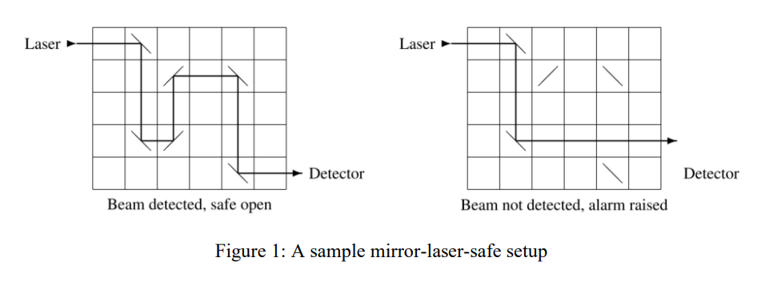
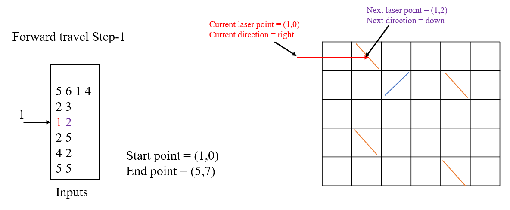
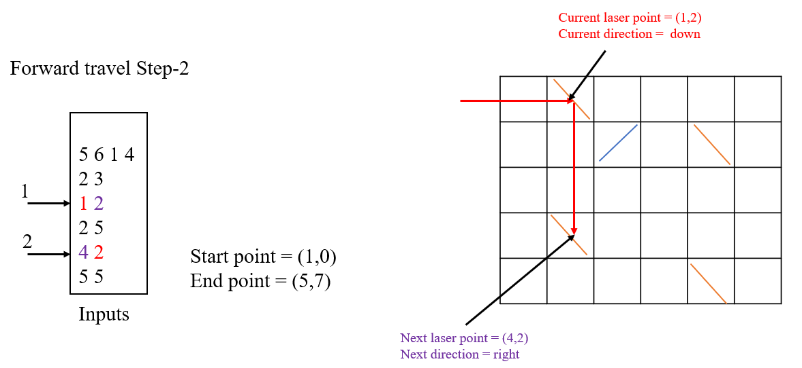
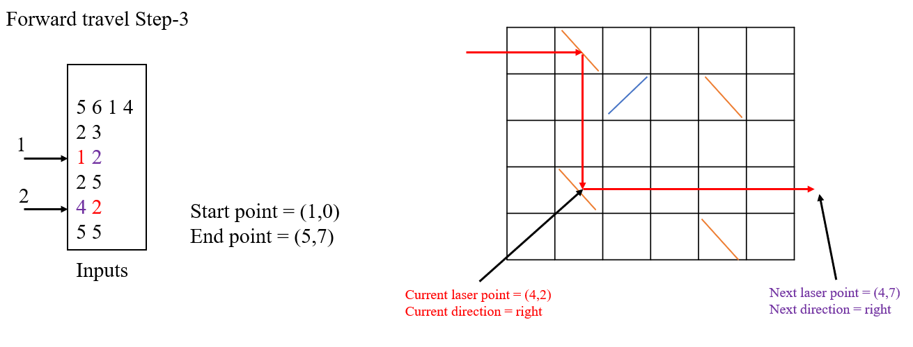
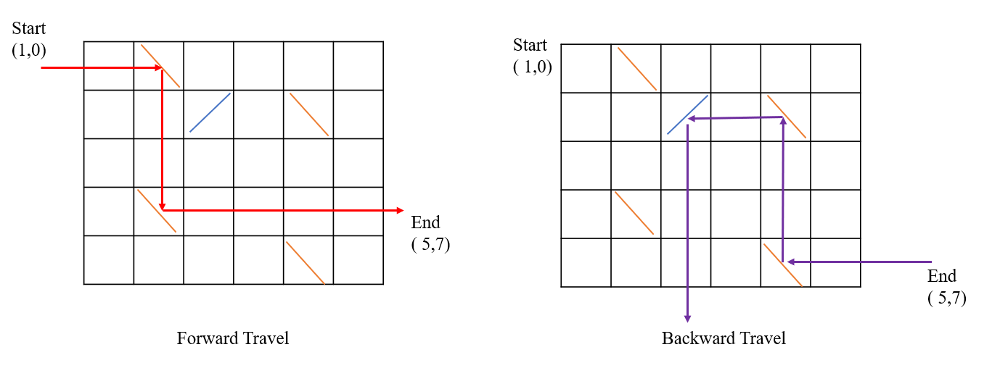
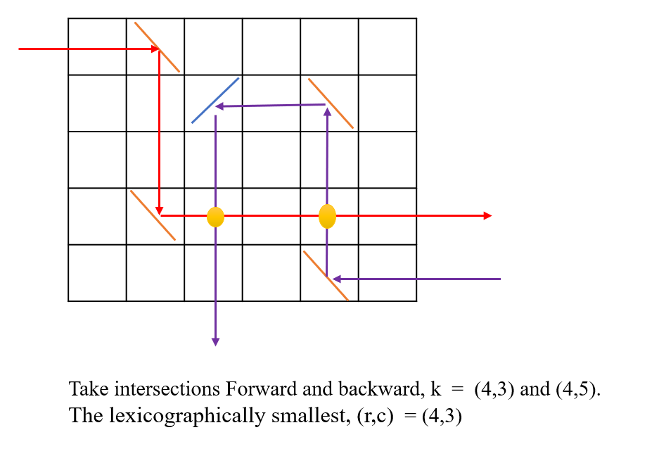
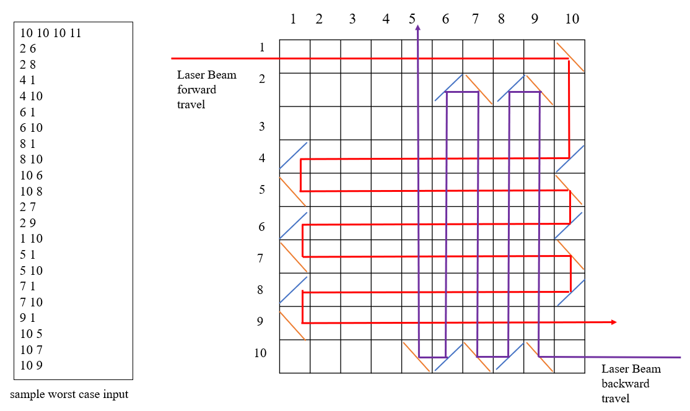

# Mirrors (Code Assignment from Ensign )

### 1. Problem

Safe Ltd. is a company that manufactures high-quality safes. Its latest invention is an optical closure  mechanism that uses a laser beam passing through a rectangular grid with several mirrors.

When the laser is activated, a beam enters the top row of the grid horizontally from the left. The beam  is reflected by every mirror that it hits. Each mirror has a `45` degree diagonal orientation, either `/` or `\`. If  the beam exits the bottom row of the grid horizontally to the right, it is detected and the safe opens (see  the left side of the figure above). Otherwise the safe remains closed and an alarm is raised. 

Each safe has a missing mirror, which prevents the laser beam from traveling successfully through the  grid (see the right side of the figure above). The safe has a mechanism that enables the user to drop a  single mirror into any empty grid cell. A legitimate user knows the correct position and orientation of  the missing mirror (/ in row 4 column 3 above) and can thus open the safe. Without this knowledge the  user has to guess correctly, which can be difficult for safes with large grids. 

Your job is to determine if particular safes are actually secure. A secure safe does not open right away  without inserting a mirror, and there is at least one valid location and orientation for the missing mirror.  There may indeed be multiple such locations and orientations.

#### Input 

Each test case describes a single safe and starts with a line containing four integer numbers `r, c, m,` and  `n (1 ≤ r, c ≤ 1000000 and 0 ≤ m, n ≤ 200000)`. The mechanisms grid has `r` rows and `c` columns.

Each of the next m lines contains two integer numbers `ri` and `ci` `(1 ≤ ri ≤ r and 1 ≤ ci ≤ c)` specifying that  there is a `/` mirror in row `ri` column `ci` . The following n lines specify the positions of the `\` mirrors in the  same way. The `m + n` positions of the mirrors are pairwise distinct.

#### Output

For each test case, display its case number followed by:

- `0` if the safe opens without inserting a mirror. 
- `k r c` if the safe does not open without inserting a mirror, there are exactly k positions where inserting  a mirror opens the safe, and `(r, c)` is the lexicographically smallest such row, column position. A position  where both a `/` and a `\` mirror open the safe counts just once. 
- `impossible` if the safe cannot be opened with or without inserting a mirror.

### Problem Analysis, Approach and Implementation

To solve this problem, we need to divide the problem into several parts.

#### 1. Firstly we need to check that the laser beam is **safe open** or **alarm raised**. 

- To check this problem we need make the laser beam to **travel forward** in code `LaserWork.Laser.laserBeam_travel_forward` (Left to Right). 

  

- But the grids input variables are `r, c, m` and theses can be `n (1 ≤ r, c ≤ 1000000 and 0 ≤ m, n ≤ 200000)`. So if we just move 1 grid cell at a time, it will take more processing time. So we need to record the input pairs (row, col and mirror status) and make sure to only travel in inputs pairs.  For better understanding please see the following steps:

  

  

- **In Forward travel step-3**: the laser beam pass to the **end point (col)** without using all of the mirrors from inputs. This define as **alarm raised** and we need move to next process.

#### 2. Secondly we need to search the where we should add the mirrors.

- ​	To know the mirrors locations, we need make **travel backward** to the crossing places. We recorded need `horizonal` and `vertical` lines from **forward travel**. And also we need recorded horizonal and vertical lines from **backward travel**.

- Only `horizonal lines` can cross `vertical lines`. So I searched intersection points between **horizonal-lines-from-backward-travel** and **vertical-lines-from-forward-travel** . And also searched  intersection points between **horizonal-lines-from-forward-travel** and **vertical-lines-from-backward-travel** . As a result is show below:

- For worst case, there can be a lot of intersection points (`k`). If we search the mirror location `(r,c)` in all these intersections, can it be take a lot of times. 

- To avoid time consuming and search **"\\"** mirror location with we need to used **binary search tree** with **row** key.

#### How to Run

- add input data to "input.txt" and save .

- `python main.py` 

#### References:

[Binary Search Tree](http://interactivepython.org/runestone/static/pythonds/Trees/SearchTreeImplementation.html.
) 